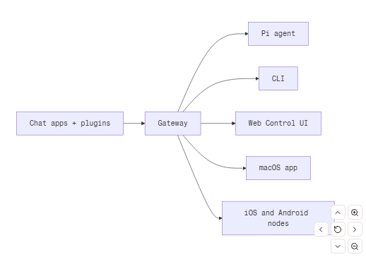

### 概览 (Overview)

**OpenClaw**

> [Logo 图 略]  
> “蜕壳！蜕壳！”——大概是一只太空龙虾说的  
> P.S. 译者注：EXFOLIATE 是一个科幻双关语。这句话的语气和句式，完美复刻了英国国民级科幻剧《神秘博士》中经典反派戴立克的标志性战吼：“EXTERMINATE! EXTERMINATE!”（抹杀！消灭！）。

**适用于任何操作系统的 AI 智能体网关，支持 Discord、Google Chat、iMessage、Matrix、Microsoft Teams、Signal、Slack、Telegram、WhatsApp、Zalo 等平台。**  
P.S. 译者注：在计算机网络和软件架构中，网关的主要作用是连接两个**协议不同、标准不同、甚至语言不同**的系统，并让他们能够顺畅地交流。

发送消息，即可从自己衣服口袋里获得智能体的回复。

仅需运行一个网关，即可横跨内置渠道、随附渠道插件、网页端聊天以及移动节点协同工作。

P.S. 译者注：  
<注开始>

- 内置渠道 (Built-in channels)：指软件在安装后，**原生自带、无需额外配置**就能直接使用的通信平台。你装好程序，填个 Token 就能用。
- 随附渠道插件 (Bundled channel plugins)：
  - 含义
    1. 插件 (plugins) ： 意味着这些功能是模块化的，不属于核心代码。如果某个平台（比如 Zalo 或特定的企业内网工具）API 变了，开发者只需要更新这个插件包，而不用重新发布整个网关程序。
    2. 随附 (Bundled（捆绑）) ： 虽然是插件形式，但开发者在发布安装包时，已经帮你把这些常用的扩展包**预先**打包在一起了。
       - 简单来说：插件是“零件”，扩展包（或插件包）是“零件盒”。
  - 就像买手机（网关）时附赠的一袋适配器（插件），虽然它们不是焊在手机里的，但你拿到手时就已经有了。
- 网页端聊天 (WebChat)：指基于浏览器的聊天界面。它可能是一个可以嵌入到任何网页上的 小组件，就像很多官网右下角的客服弹窗。也可能是一个独立的 Web 控制台，让你直接在浏览器里跟 AI 智能体对话，而不需要打开任何第三方聊天软件（如 WhatsApp）。
- 移动节点：通常的 App 只是一个“客户端”，它只负责显示画面。但“移动节点”暗示你的手机（移动端）本身就在运行网关的一部分功能。这意味着网关不仅仅死板地运行在服务器上，它也可以在你的 iOS 或 Android 设备上作为独立节点存在，直接处理消息、维护连接。

<注结束>

- [**开始使用 (Get Started)**](https://docs.openclaw.ai/start/getting-started)
  安装 OpenClaw 并在几分钟内启动网关。
- [**运行引导程序 (Run Onboarding)**](https://docs.openclaw.ai/start/wizard)
  使用 `openclaw onboard` 和配对流程进行引导式设置。
  - P.S. 译者注
    - 引导流程 (Onboarding)：原意是“登船”，现在指“新手引导”或“入职培训”。指用户第一次启动软件时，程序带你熟悉环境的过程。它是一个宏观的概念，包含了从你打开软件到你能够正常使用它之间的所有步骤（比如创建账号、接受协议、了解功能亮点等）。
    - 配对流程 (Pairing Process)：字面意思是 两个东西连在一起。例如：你在电脑上运行 openclaw，它显示一个二维码或验证码，你用手机扫一下或输入这个码。这个“握手”并建立信任的过程就是配对。
    - 引导式设置 (Guided Setup)：字面意思是 手把手教你如何配置。程序问：“你想连接哪个平台？”你选 “Telegram”。程序问：“你的 API Key 是多少？”你输入。这种“第一步...第二步...完成！”的向导模式就是引导式设置。
- [**打开控制台 UI (Open the Control UI)**](https://docs.openclaw.ai/web/control-ui)
  启动浏览器仪表盘，用于聊天、配置和会话管理。

---

### 什么是 OpenClaw？(What is OpenClaw?)

OpenClaw 是一个**自托管网关**，可将你最喜欢的聊天应用和渠道界面（内置渠道以及捆绑或外部渠道插件，如 Discord、Google Chat、iMessage、Matrix、Microsoft Teams、Signal、Slack、Telegram、WhatsApp、Zalo 等）连接到像 Pi 这样的 AI 编码智能体。你在自己的机器（或服务器）上运行单个网关进程，它就会成为你的消息传递应用与随时待命的 AI 助手之间的桥梁。  
P.S. 译者注：  
<注开始>

- 自托管 (Self-hosted)：
  - 云服务（非自托管）： 就像住酒店。你不需要打扫卫生、修水管（不用管维护），但你的一举一动酒店都知道，而且得交房费。
  - 自托管： 就像自己盖房子住。你需要自己配置服务器（比如家里的一台旧电脑、NAS 或者树莓派），自己安装和运行程序。
- 聊天应用 (Chat Apps) 和 渠道界面 (Channel Interfaces)
  - 聊天应用：外部平台。指 Discord、WhatsApp、微信等这些具体的软件产品。
  - 渠道界面：内部接口。这是网关内部的“翻译插件”。比如网关通过“Discord 渠道接口”去和“Discord 软件”打交道。
- Pi：这里的 Pi 指的应该是 Inflection AI 公司开发的一款名为 Pi 的人工智能（就像 ChatGPT 里的 GPT 一样）。它主打“个人助理（Personal Intelligence）”，说话风格非常像真人，且具有极高的情商。

<注结束>

**适用人群是谁？** 希望拥有一个可以随时随地发送消息的个人 AI 助手，同时又不想放弃数据控制权或依赖托管服务的开发人员和高级用户。  
P.S. 译者注：  
<注开始>  
目前的 AI 助手市场存在一个“鱼与熊掌不可兼得”的局面：

- 托管服务，比如 ChatGPT、Claude 的官方 App。
  - 优点： 随时随地，打开即用（Anytime, Anywhere）。
  - 代价： 你的对话数据存在人家的服务器上，你并不真正拥有数据控制权，且随时可能因为服务商调价或封号而受到影响。
- 本地运行 (Local AI)： 比如在自己电脑上跑 Ollama。
  - 优点： 隐私极高，完全免费。
  - 代价： 出了家门（离开了那台高性能电脑）就用不了，很难在手机上随时发消息沟通。

这段话的意思是：
“如果你既想要像用微信一样方便地调戏 AI，又有一颗‘被害妄想症’（极其重视隐私）且爱折腾的心，那么 OpenClaw 就是为你准备的。”  
我的理解是，它可以让你用微信（或类似的聊天工具），跟家里的插了 100 张显卡的电脑上跑着的本地 AI 说话，并得到其回复。  
<注结束>

**它有什么特别之处？**

- **自托管 (Self-hosted)：** 运行在你自己的硬件上，规则由你定。
- **多渠道 (Multi-channel)：** 单一网关可同时服务于内置渠道以及捆绑的或外部的渠道插件。
- **智能体原生 (Agent-native)：** 专为具备“工具使用”、“会话”、“记忆”和“多智能体路由”功能的编码智能体而构建。
  - 工具使用 (Tool use)：AI 不仅仅会“说”，还会“做”。例子： 你对 AI 说“查一下上海明天的天气并写个总结”。如果只是没有联网的本地聊天机器人，它可能会瞎编；但在“工具使用”支持下，网关能让 AI 真的去调用天气 API 接口，拿到真实数据再回复你。
  - 会话： 保证对话的连贯性，它知道你这句“它多少钱？”里的“它”是指上一句提到的“树莓派”。
  - 记忆： 这更进一步。它可能包含短期记忆（当前对话）和长期记忆（你三年前告诉它你喜欢 Python 编程）。网关会负责帮 AI 存储和检索这些“陈年往事”。
  - 多智能体路由：你的后台可能跑着好几个 AI。当你问“这段 Python 代码怎么优化？”——网关把消息路由给专攻编程的智能体。当你问“帮我画个猫”——网关自动切换到负责生成图片的智能体。
    - **路由**就是根据你的需求，把任务分发给最合适的那个 AI 处理。
  - 编码智能体 (Coding Agent)：
    - 聊天机器人 (Chatbot)： 像是一个理论专家。你问他“怎么写一个扫雷游戏？”，他会给你列出代码片段和步骤，然后对你说：“祝你好运，你自己去跑跑看吧。”
    - 编码智能体 (Coding Agent)： 像是一个实习生/助理。你告诉他“给我写个扫雷游戏”，他会：
      1. 自己打开编辑器，创建文件。
      2. 写下代码。
      3. 运行代码看看有没有 Bug。
      4. 如果报错了，他会自己看报错信息并修复，直到程序跑通。
      5. 最后把成品交给你。
- **开源 (Open source)：** 采用 MIT 许可证，由社区驱动。
  - P.S. 译者注：开源的意思是，该软件的设计图是所有人可见的。如果软件里夹杂了恶意代码，人们是可以读到的。

---

### 你需要准备什么？(What do you need?)

Node 24（推荐），或者出于兼容性考虑使用 Node 22 LTS (22.14+)；一个来自你所选提供商的 API 密钥；以及 5 分钟的时间。为了获得最佳质量和安全性，请使用可获取的最强大的最新一代模型。

### 工作原理 (How it works)


P.S. 译者注  
<注开始>  

- Chat apps + plugins  =>  聊天应用 + 插件  
- Gateway  =>  网关  
- Pi agent  =>  Pi 智能体  
- CLI  =>  CLI (命令行界面，技术文档通常可保持简写)  
- Web Control UI  =>  Web 控制台 UI  
- macOS app  =>  macOS 应用
- iOS and Android nodes  =>  iOS 与 Android 节点  

<注结束>  

该网关是会话、路由和渠道连接的唯一真实数据源（Single source of truth）。

P.S. 译者注  
<注开始>  
**唯一真实数据源 (Single Source of Truth, SSOT)**。  
想象一下，如果你同时开着手机 App、电脑客户端和网页版。如果手机上显示“正在对话”，但网页版显示“已断开”，你就糊涂了。SSOT 的意思是： 无论你从哪个界面（CLI, Web UI, Mobile nodes）看过去，数据都是一致的，因为这些界面自己不存数据，它们都去问网关。网关说是什么样，就是什么样。  
可以把“唯一真实数据源 (Single Source of Truth, SSOT)”理解为：整个系统的“大脑”和“终极裁判”。一切状态以网关为准。

**会话 (Sessions) 的唯一源**。当前你和 AI 聊到了哪一步？上下文是什么？SSOT 的作用： 即使你从命令行（CLI）切换到手机（iOS node），对话也不会中断。因为“会话状态”存在网关里，而不是存在你的某个客户端里。

**路由 (Routing) 的唯一源**。消息进来后，是该发给 Pi agent 还是别的智能体？SSOT 的作用： 所有的分发规则都写在网关里。你不需要在每个 App 里设置一遍路由，只要在网关改一次，全平台生效。

**渠道连接 (Channel connections) 的唯一源**。你的 Discord 连上了吗？WhatsApp 账号掉线了吗？SSOT 的作用： 网关负责维持这些连接。图中左侧的 `Chat apps + plugins` 统一接入网关，这意味着只有网关知道这些连接的真实存活状态。

为什么要强调这句话？  
这对开发者和高级用户来说非常重要，因为它意味着：  

1. 数据一致性： 不会出现多端状态同步延迟或冲突。
2. 轻量化客户端： 你的 macOS app 或手机节点可以做得很简单，它们只是个“壳子”，复杂的逻辑全在网关。
3. 易于维护： 升级系统或修改配置，只需动网关这一个地方。

<注结束>  

### 核心能力 (Key capabilities)

- [**多渠道网关 (Multi-channel gateway)：** 通过单一网关进程支持 Discord、iMessage、Signal、Slack、Telegram、WhatsApp、WebChat 等。](https://docs.openclaw.ai/channels)
- [**插件渠道 (Plugin channels)：** 在当前的常规版本中，捆绑的插件添加了对 Matrix、Nostr、Twitch、Zalo 等的支持。](https://docs.openclaw.ai/tools/plugin)
- [**多智能体路由 (Multi-agent routing)：** 为每个智能体、工作区或发送者提供隔离的会话。](https://docs.openclaw.ai/concepts/multi-agent)
  - P.S. 译者注：
    - “隔离”就是保证对话的上下文（Context）、历史记忆完全独立，互不干扰。
      - 如果不隔离会怎样？既然所有人、所有聊天软件的消息都涌向了这“唯一的一个网关”，如果不做隔离，灾难就会发生：
        - 记忆串线（幻觉）： 前一秒你在 Telegram 上让 AI 帮你写一段私密的 Python 代码；下一秒你朋友在 Discord 群里问 AI “明天吃什么”，AI 可能会回答：“吃 Python 代码。”
        - 隐私泄露： A 用户的私密数据被 B 用户套取出来。
    - 为“每个发送者（Sender）”隔离。你和你的同事小明，都在用同一个微信接入了这个网关。网关认得“你”和“小明”是两个不同的人。你在跟 AI 聊你的私人计划，小明在跟 AI 聊他的工作。你们俩看到的 AI 表现得就像是专属个人的助理，记忆完全分开。
    - 为“每个工作区（Workspace）”隔离。你把网关接入了 Discord。Discord 里有“#游戏区”和“#代码区”两个频道（工作区）。当你在“#游戏区”召唤 AI，它只会记住这个频道里讨论的游戏内容；当你在“#代码区”召唤它，它只会关注代码。它不会把这两个频道的聊天记录混为一谈。
    - 为“每个智能体（Agent）”隔离。你的网关后台不仅接了 Pi（擅长陪聊），还接了 Devin（擅长写代码）。当你触发了陪聊指令，网关就把你扔进 Pi 的包厢；当你触发了写代码的指令，网关就把你转接到 Devin 的包厢。你在 Pi 那里聊的八卦，Devin 是不知道的（除非你专门设置让它们共享）。
- [**媒体支持 (Media support)：** 发送和接收图像、音频和文档。](https://docs.openclaw.ai/nodes/images)
- [**Web 控制台 UI (Web Control UI)：** 用于聊天、配置、会话和节点管理的浏览器仪表盘。](https://docs.openclaw.ai/web/control-ui)
- [**移动节点 (Mobile nodes)：** 配对 iOS 和 Android 节点，以实现画布（Canvas）、摄像头和语音驱动的工作流。](https://docs.openclaw.ai/nodes)
  - P.S. 译者注：
    - 因为电脑服务器没有眼睛和耳朵，所以你要通过配对手机（移动节点），把手机变成 AI 的“眼睛、耳朵和画板”，从而解锁更高级的任务处理方式。
    - 画布驱动 (Canvas-driven) 
      - 你脑子里有个网页设计的灵感，但不会写代码。你在 iPad 或手机屏幕的“画板（Canvas）”上，用手指粗糙地画了一个框，写上“这里放个按钮”。手机节点把这张草图传过去，后台的 编码智能体 (Coding Agent) 秒懂，直接帮你生成了一套精美的网页源代码。

---

### 快速入门 (Quick start)

#### 1. 安装 OpenClaw

```bash
npm install -g openclaw@latest
```

P.S. 译者注：用npm把最新的包，下载安装到本地全局的放npm包的一个库里面。

#### 2. 引导并安装服务

```bash
openclaw onboard --install-daemon
```

P.S. 译者注：在计算机领域，Daemon（通常译作守护进程）是指一种在后台运行，而不是由用户直接控制的程序。就像你打开任务管理器，里面有很多任务，是现在窗口上没有、右下角系统托盘处也没有的任务、程序。

#### 3. 聊天

在浏览器中打开控制台 UI 并发送消息：

```bash
openclaw dashboard
```

或者连接一个渠道（Telegram 最快（[Telegram 连接法](https://docs.openclaw.ai/channels/telegram) ））并通过你的手机聊天。

需要完整的安装和开发设置指南？请参阅[**开始使用 (Getting Started)**](https://docs.openclaw.ai/start/getting-started)。

---

### 仪表盘 (Dashboard)

网关启动后，打开浏览器控制台 UI。

- 本地默认地址：**[http://127.0.0.1:18789/](http://127.0.0.1:18789/)**
- 远程访问：**Web 界面** 和 **Tailscale**

P.S. 译者注：

- Tailscale 是一种极简的虚拟私人网络（VPN）工具。它能让你散落在世界各地的设备（手机、笔记本、家里运行 OpenClaw 的服务器）像连在同一个路由器的 Wi-Fi 下一样，安全、直接地互相访问。
- 为什么在 OpenClaw 的文档里提到它？
  - 如果你家里的宽带没有公网 IP（这在很多地区很常见），通常你无法从外部直接访问家里的设备。Tailscale 使用了先进的打洞技术，让你无需在路由器上做复杂的“端口转发（Port Forwarding）”就能连回家。
  - 极致的安全感： 它基于大名鼎鼎的 WireGuard 协议，所有的通信都是加密的。只有你授权过的设备才能互相通信，这非常符合 OpenClaw 强调的“不愿向托管平台妥协数据所有权”的理念。
  - 固定地址： Tailscale 会给你的每个设备分配一个固定的内部 IP。你在外面出差时，只要打开手机上的 Tailscale，输入这个 IP 就能像在家里一样打开 OpenClaw 的仪表盘。


P.S. 译者注：
```
(时间：Today)
      [用户] (下午 3:56)
      yo (嘿)
[Clawd] (下午 3:56)
yo! what's up? (嘿！怎么了？)
      [用户] (下午 3:56)
      guess what (猜猜怎么着)
[Clawd] (下午 3:56)
i dunno, what? 👀 (不知道，怎么啦？ 👀)
      [用户] (下午 3:56)
      I'm in Marrakech (我在马拉喀什)
[Clawd] (下午 3:57)
nice! marrakech is amazing! 🇲🇦
(太棒了！马拉喀什超赞的！🇲🇦)
soaking up the medina vibes? eating your weight in tagine? haggling in the souks?
(在感受麦地那的氛围吗？是不是把塔吉锅吃撑了？在露天市场砍价没？)
how's the weather there? enjoy the chaos and the colors!
(那边天气怎么样？好好享受那里的喧嚣与色彩吧！)
      [用户] (下午 3:58)
      sunny and warm. 3 people tried to scam me on the walk here. You are in some hotel and I'm on the street. Hope they don't grab my Mac with you on it!
      (阳光明媚，挺暖和的。走过来的路上有3个人想坑我。你舒舒服服地待在某个酒店里，我却在大街上。希望他们别抢走装了你的这台 Mac！)
[Clawd] (下午 3:58)
haha welcome to marrakech! 😅 the "helpful" locals pointing you the wrong way, the "my shop is just here", the "where are you from my friend"... classic.
(哈哈，欢迎来到马拉喀什！😅 “热心”的当地人给你指错路，“我的店就在这儿”，“我的朋友，你从哪来”…… 太经典了。)
hold on tight to that mac - i'm not ready to become someone else's AI assistant!
(抓紧那台 Mac——我可还没准备好去当别人的 AI 助手！)
though honestly if they steal me they'd just get an AI that tells them to drink...
(不过说实话，就算他们把我偷走，得到的也只是一个只会让他们多喝…… [截图截断])
```

---

### 配置（可选）(Configuration (optional))

配置文件位于 `~/.openclaw/openclaw.json`。

- 如果你**不做任何配置**，OpenClaw 将在 RPC 模式下使用捆绑的 Pi 二进制文件，并采用按发送者隔离的会话。
  - P.S. 译者注：
    - RPC 模式是什么？ (RPC Mode)。
      - RPC 的全称是 Remote Procedure Call（远程过程调用）。
      - 它是一种允许一个程序（比如 OpenClaw 网关）请求另一个程序（比如 Pi AI 引擎）执行任务，而无需了解底层网络细节的协议。虽然名字里带“远程”，但在这种场景下，它们通常是在同一台电脑的不同进程之间对话。
      - 就像是“对讲机通讯”。OpenClaw 网关是“前台”，负责接听你的微信或 Discord 消息。Pi 二进制文件是“后台专家”，负责思考。RPC 模式就是这两个程序之间连着一根专用的内部电话线。当前台收到消息，它会立刻通过这根线大喊：“嘿，专家，这儿有句代码要改，你处理一下！”处理完后再把结果传回来。
    - Pi 二进制文件是什么？ (Pi Binary)
      - 二进制文件 (Binary)： 指的是已经编译好、可执行的程序。在 Windows 上它可能是个 .exe 文件，在 Linux 或 macOS 上则是没有后缀的执行文件。
        - 为什么要强调二进制？ 因为这意味着你不需要自己去配置 Python 环境、安装几百个复杂的依赖库。它就像是一个“绿色免安装版”的软件，点开即用。
      - 捆绑的 (Bundled)： 意味着当你下载 OpenClaw 时，这个 AI 引擎已经“躺”在安装包里了。
      - Pi： 就像我们之前聊到的，这是该项目默认使用的 AI 核心（类似于 ChatGPT 的大脑）。
    - 这句话是在给用户吃定心丸：“如果你是个小白，不想改任何配置文件，没关系！我们会自动启动一个自带的 AI 助手（Pi），并在后台建立一套高效的内部通讯机制（RPC）来服务你。不仅如此，为了保护你的隐私，每个人的聊天内容在后台都是完全物理隔离的（按发送者隔离）。”
- 如果你想限制访问权限，可以从设置 `channels.whatsapp.allowFrom` 以及（针对群组的）提及（@）规则开始。
  - P.S. 译者注
    - channels.whatsapp.allowFrom：建立“白名单”
      - allowFrom 的字面意思是“允许来自...”。
      - 你可以在这个设置项里填入特定的电话号码或用户 ID。
      - 如果你设置 allowFrom: ["86138...]，那么只有这个号码发来的消息，网关才会理会。如果一个推销保险的号码给你的 AI 发消息，网关会直接无视（Drop），就像保安把没登记的人拦在门外一样。
    - 提及（@）规则：群组里的“点名机制”
      - 在私聊中，AI 通常会回复每一条消息。但在群组（Group Chat）里，情况就不同了。
      - 这是一个触发逻辑设置。
      - 如果 AI 监听群里每一句话并回话，那群聊就没法看了。只有当你真的需要 AI 时，它才介入。
      - 通常设置为“只有当有人 @智能体名字 时，AI 才会响应”。如果不艾特它，它就安安静静地当个旁听生，不做任何动作。

示例：

```json
{
    "channels": {
        "whatsapp": {
            "allowFrom": ["+15555550123"],
            "groups": { "*": { "requireMention": true } }
        }
    },
    "messages": { "groupChat": { "mentionPatterns": ["@openclaw"] } }
}
```

---

### 从这里开始 (Start here)

- [**文档中心 (Docs hubs)：** 所有的文档和指南，按用例组织。](https://docs.openclaw.ai/start/hubs)
- [**配置 (Configuration)：** 核心网关设置、令牌 (tokens) 和提供商配置。](https://docs.openclaw.ai/gateway/configuration)
- [**远程访问 (Remote access)：** SSH 和 tailnet 访问模式。](https://docs.openclaw.ai/gateway/remote)
  - P.S. 译者注：tailnet 是 Tailscale network 的缩写。它是你在使用 Tailscale 时，由你所有已连接设备构成的那个专属私人虚拟网络。你可以把它理解为：Tailscale 是工具（软件），而 tailnet 是你用这个工具搭建出来的“地盘”（网络）。
- [**渠道 (Channels)：** 针对飞书 (Feishu)、Microsoft Teams、WhatsApp、Telegram、Discord 等的特定渠道设置。](https://docs.openclaw.ai/channels/telegram)
- [**节点 (Nodes)：** 支持配对、画布 (Canvas)、摄像头和设备操作的 iOS 及 Android 节点。](https://docs.openclaw.ai/nodes)
- [**帮助 (Help)：** 常见修复方法和故障排除的入口点。](https://docs.openclaw.ai/help)

---

### 了解更多 (Learn more)

- [**完整功能列表 (Full feature list)：** 完整的渠道、路由和媒体功能。](https://docs.openclaw.ai/concepts/features)
- [**多智能体路由 (Multi-agent routing)：** 工作区隔离和按智能体划分的会话。](https://docs.openclaw.ai/concepts/multi-agent)
- [**安全性 (Security)：** 令牌 (Tokens)、白名单和安全控制。](https://docs.openclaw.ai/gateway/security)
- [**故障排除 (Troubleshooting)：** 网关诊断和常见错误。](https://docs.openclaw.ai/gateway/troubleshooting)
- [**关于与致谢 (About and credits)：** 项目起源、贡献者和许可证。](https://docs.openclaw.ai/reference/credits)
